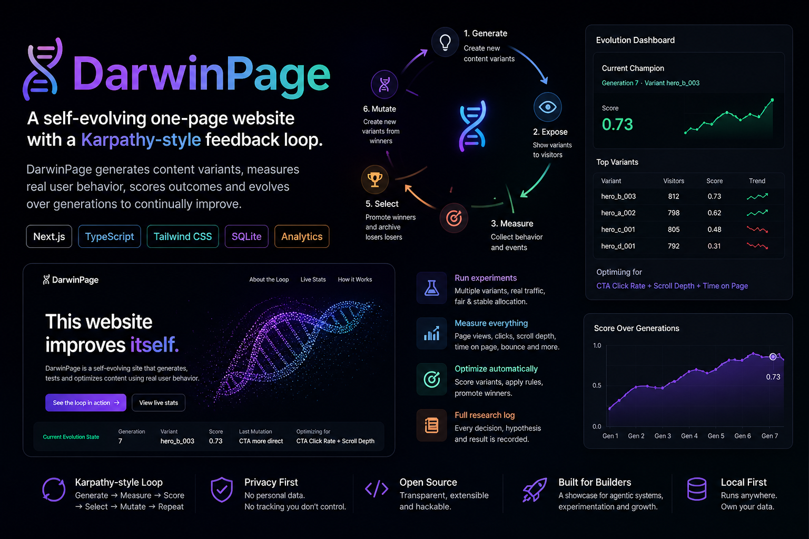

# DarwinPage

A self-evolving one-page website with a Karpathy-style feedback loop.



## What it is

DarwinPage is not just an A/B testing demo. It is a minimal, self-optimizing content system. It dynamically generates page variants, measures user behavior, scores outcomes, and autonomously evolves the page over consecutive generations. 

The public face of the project is a single, focused landing page (`/`). The backend acts as the evolutionary engine, constantly seeking the optimal configuration of headlines, CTAs, and layout.

## Why it matters

Building systems that write code or generate content is easy. Building systems that learn and adapt based on empirical evidence is much harder. DarwinPage demonstrates how to close the loop: connecting generative capabilities with objective, real-world metrics to create software that naturally improves its own performance over time.

This project exists to showcase a clean, technical implementation of an autonomous optimization loop within a modern web framework.

## Inspired by Karpathy-style AutoResearch loops

The architecture draws heavy inspiration from Karpathy's AutoResearch concepts:
- **Hypothesis-driven**: Every mutation is backed by a specific hypothesis.
- **Measurable**: Clear fitness functions define what "better" means.
- **Traceable**: A robust `ResearchLog` ensures the reasoning behind every evolution is transparent.

## Feedback loop

The system follows a strict, 7-step evolutionary cycle:

1. **Generate**: Create candidate variants.
2. **Expose**: Serve a stable variant to users.
3. **Measure**: Anonymously track telemetry (views, clicks, scrolls).
4. **Score**: Calculate fitness via a weighted metric.
5. **Select**: Identify statistical winners.
6. **Mutate**: Derive new hypotheses from successful traits.
7. **Log**: Document the entire cycle.

*See [FEEDBACK_LOOP.md](docs/FEEDBACK_LOOP.md) for detailed diagrams and explanations.*

## Architecture

Built with a modern, focused tech stack:
- **Next.js (App Router)** for the framework.
- **TypeScript & Tailwind CSS** for robust, beautiful frontend design.
- **SQLite & Drizzle/Prisma** for the lightweight local database.

*See [ARCHITECTURE.md](docs/ARCHITECTURE.md) for the component breakdown.*

## Metrics

The optimization target isn't just "more clicks." The fitness function balances CTA conversion, scroll depth, time on page, and bounce rate to ensure high-quality engagement.

*See [METRICS.md](docs/METRICS.md) for the scoring formula.*

## Local setup

```bash
# 1. Install dependencies
npm install

# 2. Seed the database with initial variants
npm run db:seed

# 3. Start the development server
npm run dev
```

Visit `http://localhost:3000` to see the public evolving page.
Visit `http://localhost:3000/admin` to view the internal dashboard and trigger the evolution scripts manually.

## How variants work

A variant is a structured JSON configuration that defines the page's content and layout parameters. This includes the hero headline, subheadline, CTA text, tone, section order, and layout density. The `/` route dynamically constructs the page based on the active variant assigned to the visitor's session.

## How evolution works

Scripts located in the `scripts/` directory manage the lifecycle:
- `npm run analyze`: Aggregates events and calculates scores.
- `npm run promote-winner`: Selects a winner if statistical requirements are met.
- `npm run evolve`: Generates the next generation of variants.
- `npm run research-cycle`: Runs the entire loop end-to-end.

## Privacy

We prioritize user privacy. DarwinPage operates on strict rules:
- **No PII**: No IP addresses, emails, or personal data are stored.
- **No Fingerprinting**: We rely on anonymous session IDs stored locally.
- **Transparent**: The loop works without dark patterns or invasive trackers.

## Roadmap

See [ROADMAP.md](docs/ROADMAP.md) for the planned evolution from a rule-based MVP to an LLM-driven optimizer.

## Demo ideas

- Launching the project with a generic "Welcome" message and watching it evolve into a highly-tuned technical pitch.
- Artificially adjusting the metric weights (e.g., heavily weighting scroll depth) and watching the layout density and section order adapt in real-time.
