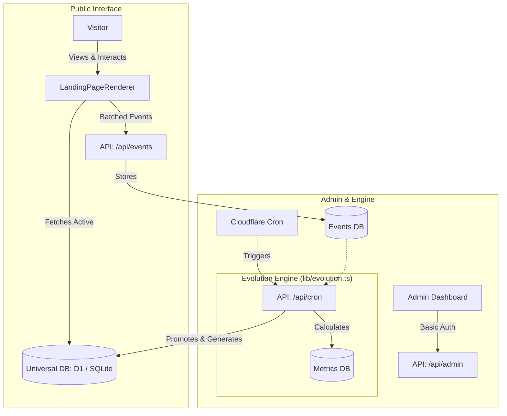

# Architecture

DarwinPage is built as a minimal, focused Next.js App Router project that integrates a complete Karpathy-style "Generate-Measure-Score-Evolve" loop.

## High-Level Architecture

The system is conceptually divided into three layers:

1. **The Public Interface (Expose & Measure)**
   - A single Next.js page (`/`) that dynamically renders content variants.
   - Anonymized telemetry events are captured (e.g., page views, CTA clicks, scroll depth, time on page) without persisting personally identifiable information (PII).

2. **The Experiment Engine (Score & Select)**
   - Backend APIs handle incoming telemetry, aggregating events into `MetricSnapshot` records.
   - The engine calculates scores based on a configurable formula.
   - Selection logic determines when a variant has statistically won based on sample size and experiment duration.

3. **The Evolution Engine (Generate & Mutate)**
   - Takes successful variants and runs them through a `VariantGenerator`.
   - Derives mutations based on performance observations (e.g., "Variant B had high scroll depth but low CTA clicks -> mutate the CTA to be more direct").
   - Logs every step of the decision-making process into a `ResearchLog`.

## Component Diagram

## Data Models

- **Variant**: Represents a specific version of the page content.
- **Event**: A single user action (view, click, scroll).
- **MetricSnapshot**: Aggregated metrics for a given variant.
- **OptimizationConfig**: The scoring weights and rules defining the current fitness landscape.
- **ResearchLog**: A historical ledger of the evolution process.
