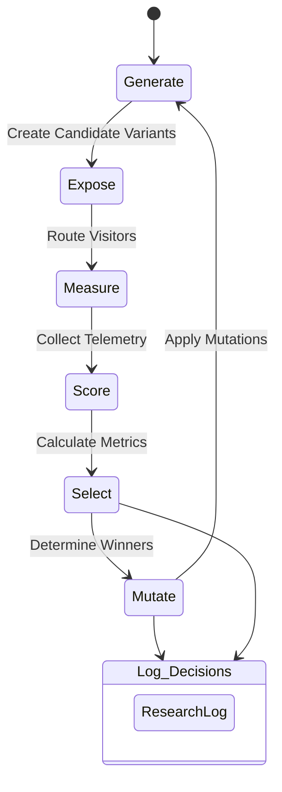

# The Feedback Loop

Inspired by Karpathy-style AutoResearch loops, DarwinPage operates on a continuous, autonomous evolutionary cycle.

## Cycle Stages

### 1. Generate
The system spawns candidate variations of the page. This can include modifying the headline, refining the primary CTA, adjusting tone, or reordering sections.

### 2. Expose
Visitors to `/` are consistently routed to a specific active variant. Consistency is maintained via an anonymous cookie, ensuring a stable experience.

### 3. Measure
Telemetry data is collected continuously. Events such as `page_view`, `cta_click`, `scroll_depth_*`, and `time_on_page` are logged directly against the `variant_id`.

### 4. Score
A configurable backend script evaluates each active variant against a defined fitness function (see [METRICS.md](./METRICS.md)).

### 5. Select
Winning criteria must be met before promotion. This includes a minimum number of visitors, a minimum duration (e.g., 3 days), and a statistically significant improvement over the baseline.

### 6. Mutate
Once a winner is identified, new candidates are derived from it. The mutation carries a hypothesis (e.g., "Shorter CTA will improve click rate").

### 7. Log
Every phase generates a clear paper trail in the `ResearchLog`. Every hypothesis, outcome, and decision is stored, preventing the system from repeating past mistakes.
